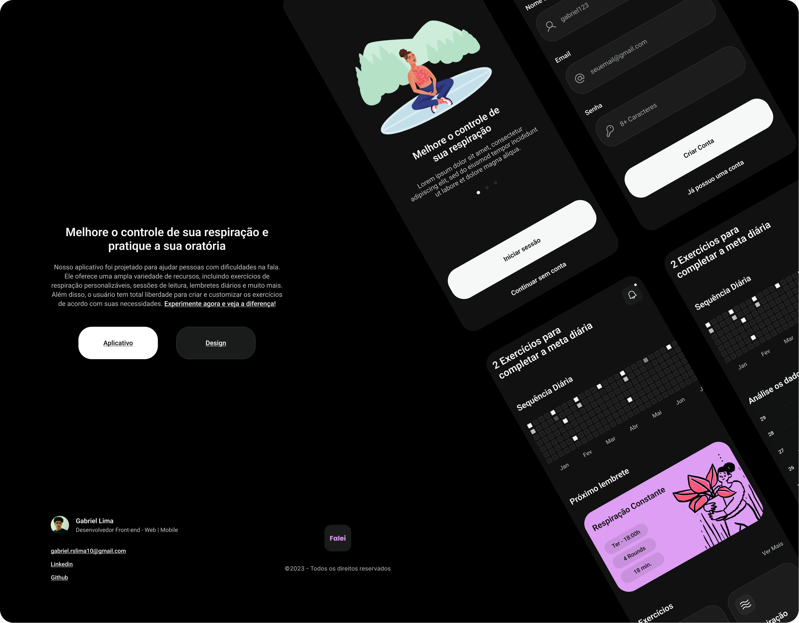
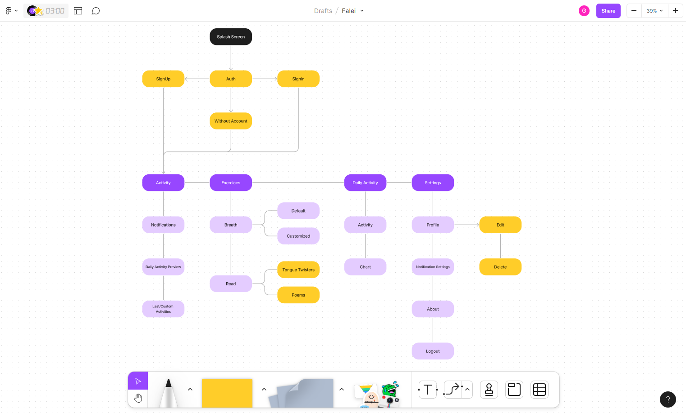
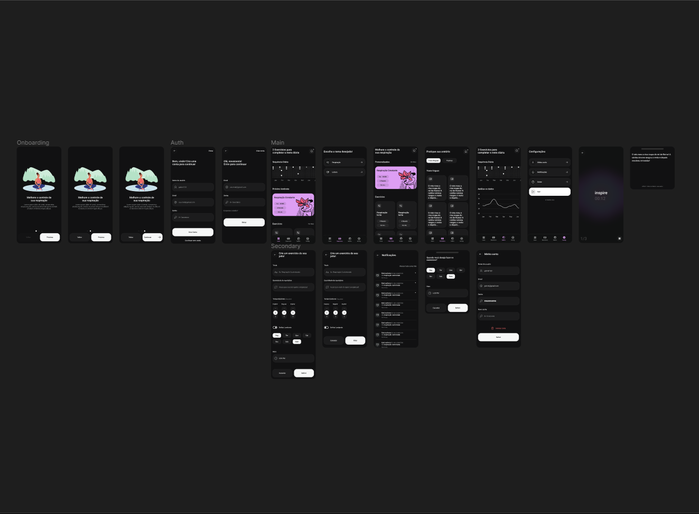

<h1 align="center">
    
    <br>
    Falei! Aplicativo projetado para ajudar pessoas com dificuldades na fala(Em desenvolvimento)
</h1>

<div align="center">
  <a href="https://github.com/gabriellima2/falei-app/blob/main/LICENSE" rel="noreferrer" target="_blank">
  </a>
</div>

<br />

<div align="center">
  <a href="#about">Sobre</a>
  &nbsp;
  <a href="#techs">Tecnologias</a>
  &nbsp;
  <a href="#overview">Visão Geral</a>
  &nbsp;
  <a href="#run">Rodando o projeto</a>
</div>

<br />

<div align="center">
  
</div>

<h3 align="center">O aplicativo Falei! oferece uma ampla variedade de recursos, incluindo exercícios de respiração personalizáveis, sessões de leitura, lembretes diários e muito mais.</h3>

<p align="center"><a href="#">Em desenvolvimento</a></p>

<h2 id="about">Sobre</h2>

Como uma pessoa que gagueja, eu entendo bem as dificuldades enfrentadas ao falar. Praticar a respiração e falar diariamente são ações que podem ajudar a melhorar a fluência. Com isso em mente, reuni informações e exercícios úteis para ajudar você melhorar a fala.

Nosso aplicativo oferece:

- Exercícios de respiração
- Sessões de leitura
- Lembretes diários
- Gráficos para acompanhar suas atividades diárias
- Informações iniciais para ajudá-lo a entender sua condição

É importante destacar que consultar um profissional qualificado é sempre recomendável para ajudá-lo a lidar com a gagueira. Nosso aplicativo serve como um recurso inicial para aqueles que não têm condições financeiras para consultas com profissionais ou conhecimento prévio sobre o assunto.

<h2 id="techs">Tecnologias:</h2>

- [React Native](https://reactnative.dev/)
- [Expo](https://expo.dev/)
- [Typescript](https://www.typescriptlang.org/)
- [React Navigation](https://reactnavigation.org/)

<h2 id="overview">Visão Geral:</h2>
Veja um pouco do que foi feito no desenvolvimento do aplicativo!

<h3>Fluxograma</h3>

<div align="center">
  
</div>

<h3>Design</h3>

<div align="center">
  
</div>

<div align="center">
  <a href="https://www.figma.com/" rel="noreferrer" target="_blank">
  </a>
</div>

<h2 id="run">Rodando o projeto:</h2>

Você precisa ter o [Node](https://nodejs.org/en/), o [Git](https://git-scm.com/) e algum gerenciador de pacotes([NPM](https://docs.npmjs.com/downloading-and-installing-node-js-and-npm/) || [Yarn](https://classic.yarnpkg.com/lang/en/docs/install)) instalados em sua máquina.

Use o [ExpoGo](https://expo.dev/client) para rodar o app no seu dispositivo fisico ou no emulador.

```bash
1. Clone o repositório:
$ git clone https://github.com/gabriellima2/falei-app.git

2. Acesse a pasta e instale as dependências via terminal:
$ yarn || npm i

3. Inicie a aplicação em modo de desenvolvimento:
$ yarn start || npm run start

4. Escaneie o QRCode ou digite a URL informada
```
<p align="center">Projeto feito com 💙 por <a href="https://www.linkedin.com/in/gabriel-lima-860612236">Gabriel Lima</a></p>
